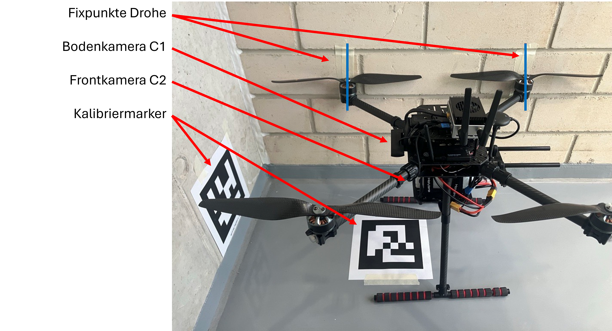

# Workspace `ws_humble` – Positionierung, Kalibrierung und Steuerung

Dieser Workspace wird zur **extrinsischen Kalibrierung**, zur **Positionierung** und zur **Steuerung** benötigt.
Er läuft unter **ROS2 Humble** (auch auf dem Jetson).

## Verzeichnisstruktur

```
ws_humble
├── Einstellungen
│   ├── Kamera_intrinsics
│   └── Maps
├── launch
│   ├── control
│   ├── Kalibrierung
│   └── Positionierung
├── readme.md
└── src
    ├── control_package
    ├── drone_camera_calibration
    ├── drone_vision_pose_publisher
    ├── isaac_ros_apriltag_interfaces
    ├── isaac_ros_common
    └── px4_msgs
```

| Verzeichnis | Beschreibung |
| --- | --- |
| `Einstellungen/` | Sämtliche Einstellungen (verwendete Karte, Kamera-Parameter, Kalibriermatrix bzw. Einstellungen der Kalibrierbox). |
| `launch/` | Launch-Dateien zum Starten von Steuerung, Kalibrierung und Positionierung. |
| `src/` | Quellcode der ROS2-Pakete. |

## Bauen und Sourcen

Ist der Workspace noch nicht gebaut (kein `install`-Ordner vorhanden) oder wurden Pakete geändert, muss zunächst gebaut werden:

```bash
colcon build --symlink-install
```

Anschließend – und in jedem neuen Terminal – den Workspace sourcen:

```bash
source install/setup.bash
```

## `Einstellungen/`

Hier werden alle Einstellungen getroffen.

```
Einstellungen
├── Kamera_intrinsics
│   ├── C920
│   │   ├── down_1280_720_C920.yaml
│   │   ├── down_640_480_C920.yaml
│   │   ├── front_1280_720_C920.yaml
│   │   └── front_640_480_C920.yaml
│   ├── C922
│   │   ├── camera_640_480_922.yaml
│   │   └── logitech_c922_1280_720.yaml
│   ├── camera_640_480.yaml
│   └── logitech_c920_640_480.yaml
└── Maps
    ├── Aufgenommen
    │   ├── ground_truth.yaml
    │   ├── versuch_1.yaml
    │   ├── versuch_2.yaml
    │   └── versuch_3.yaml
    └── Kalibrierung
        ├── map_Kalibrierung_result.yaml
        └── map_Kalibrierung.yaml
```

| Verzeichnis | Beschreibung |
| --- | --- |
| `Kamera_intrinsics/` | Intrinsische Kamera-Parameter je Kamera (C920, C922) und Auflösung. |
| `Maps/Aufgenommen/` | Abgespeicherte Karten. `ground_truth.yaml` ist die am OIC geklebte Karte, `versuch_1/2/3.yaml` sind die aufgenommenen Kartierungen. |
| `Maps/Kalibrierung/` | Kalibrierdaten. `map_Kalibrierung.yaml` beschreibt die vermessene Kalibrierbox, `map_Kalibrierung_result.yaml` enthält das Ergebnis der extrinsischen Kalibrierung. |

Die aktive Karte und die verwendeten Kamera-Intrinsics werden in der jeweiligen Launch-Datei ausgewählt.

## `launch/`

```
launch
├── control
│   └── control_launch.sh
├── Kalibrierung
│   └── Kalibrierung_1280_720_C920.launch.py
└── Positionierung
    └── Live_Positionierung_uxrce.launch.py
```

### Steuerung (`control/`)

Die Steuerung (Fernbedienung) wird gestartet über:

```bash
./launch/control/control_launch.sh
```

Das Skript startet die uXRCE-Bedienkonsole (`control_console_uxrce.py`) **direkt im aktuellen Terminal**, nicht über `ros2 launch`. Grund ist die curses-Oberfläche, die ein echtes interaktives Terminal benötigt, damit die Tastendrücke ankommen. Der Workspace wird dabei automatisch gesourct; das Skript setzt voraus, dass das Repository unter `~/Apriltag_UAV_Lokalisierung` liegt.

Die Konsole sendet kontinuierlich Soll-Positionen an PX4, führt den Systemzustand zusammen und zeigt alle Funktionen im Terminal an. Die Bewegungs- und Startparameter haben Standardwerte und lassen sich per Umgebungsvariable (`demo_speed_mps=0.2 ./control_launch.sh`) oder per zusätzlichem `-p` (`./control_launch.sh -p demo_speed_mps:=0.2`) überschreiben:

| Parameter | Standard | Bedeutung |
| --- | --- | --- |
| `demo_edge_length_m` | `2.0` | Kantenlänge des Demo-Quadrats |
| `demo_speed_mps` | `0.3` | Geschwindigkeit im Demo-Modus |
| `descent_speed_mps` | `0.3` | Sinkgeschwindigkeit bei der Landung |
| `takeoff_offset_m` | `1.5` | Steighöhe beim Armieren |
| `demo_center_x` / `demo_center_y` | `0.0` | Mittelpunkt des Demo-Quadrats |

Die Steuerung erfolgt vollständig über die Tastatur:

| Taste | Funktion |
| --- | --- |
| `a` / `d` | Sollwert in x verschieben |
| `w` / `s` | Sollwert in y verschieben |
| `o` / `l` | Sollwert in z verschieben |
| `q` / `e` | Gierwinkel-Sollwert verstellen |
| Leertaste | Armieren, im armierten Zustand Landung an Ort und Stelle |
| `g` | Demo-Modus starten, bei erneuter Betätigung abbrechen |
| Esc | Konsole beenden |

### Kalibrierung (`Kalibrierung/`)

Die Kalibrierung bestimmt die Transformationsmatrizen zwischen den Kameras und dem PX4.



Start:

```bash
ros2 launch launch/Kalibrierung/Kalibrierung_1280_720_C920.launch.py
```

Das Launch-File startet:

- die **Bodenkamera** (gscam, Kamera 1, C922) und die **Frontkamera** (gscam, Kamera 2, C920), jeweils mit 1280 × 720 über eine hardwarebeschleunigte MJPEG-Pipeline,
- die **statischen optischen TFs** je Kamera (`camera_X → camera_X_optical_frame`),
- den **`drone_camera_calibration_node`** mit integrierter Live-Lokalisierung. Er berechnet je Kamera aus `/camera_X/tag_detections` die Transformation `T_map_camera`, daraus die Extrinsik `T_drone_camera_X`, veröffentlicht `liveposition` und TF und schreibt das über jeweils **100 Messwerte gemittelte** Ergebnis nach `map_Kalibrierung_result.yaml`.

Parallel muss in einem **zweiten Terminal** das Launch-File für zwei Kameras aus dem `isaac_ws` gestartet werden (Detektion und Entzerrung im Isaac-Container):

```bash
ros2 launch launch/dual_cam_.launch.py
```

Zur Kalibrierung müssen **beide Kameras jeweils einen Tag sehen**. Die Tags sind zueinander und zum PX4 vermessen; die Tag-ID des Drohnenmittelpunkts ist in `map_Kalibrierung.yaml` hinterlegt.
Wird an der Kalibrierbox etwas geändert, muss `Einstellungen/Maps/Kalibrierung/map_Kalibrierung.yaml` entsprechend angepasst werden.

> **Hinweis:** Auch ohne erneute Kalibrierung funktioniert das Setup, solange die Bodenkamera nach unten und die Frontkamera nach vorne schaut.

### Positionierung (`Positionierung/`)

Das Launch-File `Live_Positionierung_uxrce.launch.py` startet die vollständige Live-Positionierung auf dem Jetson:

- den **Micro-XRCE-DDS-Agent** (UDP über Ethernet, Port 8888) für die Verbindung zu PX4,
- die **Bodenkamera** (gscam, Kamera 1) mit 1280 × 720 bei 60 FPS über eine hardwarebeschleunigte MJPEG-Pipeline (die Frontkamera ist deaktiviert),
- die **statischen TFs** für die Isaac-AprilTag-Kette (`tag_map → isaac → camera_1_optical_frame`) sowie `tag_map → Karte` für die RViz-Visualisierung,
- den **`vision_pose_uxrce_node`**, der die Tag-Detektionen der Bodenkamera (`/camera_1/tag_detections`) liest, daraus die Drohnenpose berechnet und diese als `VehicleOdometry` (NED/FRD) mit 50 Hz auf `/fmu/in/vehicle_visual_odometry` an PX4 publiziert.

Die aktive Karte, die Kalibrierdatei und die Kamera-Intrinsics werden in der Launch-Datei gesetzt.

Start:

```bash
ros2 launch launch/Positionierung/Live_Positionierung_uxrce.launch.py
```

**Für einen Flug werden drei Terminals benötigt:**

1. `isaac_ws` – Detektion und Entzerrung (Kamera-Launch-File im Isaac-Container),
2. `ws_humble` – Steuerung (`./launch/control/control_launch.sh`),
3. `ws_humble` – Positionierung (`ros2 launch launch/Positionierung/Live_Positionierung_uxrce.launch.py`).

> **Wichtig:** Für den Flug werden mehr als 30 FPS benötigt. Die **Logitech C920 funktioniert dafür nicht** (zu wenige FPS); für die Positionierung wird die **Logitech C922** eingesetzt.

## `src/`

Hier ist der Quellcode der ROS2-Pakete abgelegt.

| Paket | Beschreibung |
| --- | --- |
| `control_package` | Der Control-Node: sendet die Positions-Sollwerte an PX4 und übernimmt die Anzeige des Systemzustands. |
| `drone_vision_pose_publisher` | Berechnet die eigentlichen Positionsdaten (Drohnenpose) aus den Tag-Detektionen und publiziert sie an PX4. |
| `drone_camera_calibration` | Berechnet die extrinsische Transformation zwischen den Kameras und dem PX4, gemittelt aus jeweils 100 Messungen. |
| `isaac_ros_apriltag_interfaces` | Nachrichtentypen der Isaac-AprilTag-Erkennung; für den Betrieb des Systems notwendig. |
| `isaac_ros_common` | Gemeinsame Isaac-ROS-Basis; für den Betrieb des Systems notwendig. |
| `px4_msgs` | PX4-Nachrichtentypen für die Anbindung an den Flugcontroller; für den Betrieb des Systems notwendig. |
